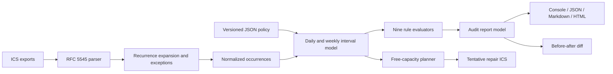

# Architecture

RhythmLint separates parsing, schedule semantics, rules, presentation, and mutation-free
repair. The CLI is an adapter; every substantive operation is available from testable
TypeScript modules.

## Modules

| Module             | Responsibility                                                                                            |
| ------------------ | --------------------------------------------------------------------------------------------------------- |
| `src/config.ts`    | Deep-merge defaults, validate clocks/timezones/patterns/ranges, resolve an explicit audit window          |
| `src/ics.ts`       | Parse calendars, register VTIMEZONE, expand RRULE/RDATE/EXDATE, apply exceptions, deduplicate occurrences |
| `src/time.ts`      | IANA-zone conversion, date keys, interval merge/intersection/subtraction                                  |
| `src/analyze.ts`   | Classify events, build workday/weekly metrics, emit stable evidence-rich findings                         |
| `src/rules.ts`     | Public catalog of stable rule IDs                                                                         |
| `src/overlay.ts`   | Select conflict-free free intervals and serialize deterministic tentative holds                           |
| `src/diff.ts`      | Compare identical windows by metrics and finding fingerprints                                             |
| `src/reporters.ts` | Deterministic terminal, JSON, Markdown, and script-free HTML rendering                                    |
| `src/cli.ts`       | Arguments, files, exit codes, explicit writes, and error boundary                                         |

## Normalized event invariants

- Every occurrence has an ID derived from UID, recurrence ID, and UTC start.
- `start < end`; invalid durations become parser diagnostics and are not analyzed.
- Inputs are deduplicated by UID, recurrence ID, and start so overlapping exports do not
  double count the same occurrence.
- Cancelled, transparent, ignored, and all-day events remain in evidence but do not count
  toward timed load.
- Meeting time is the union of meeting intervals. Overlapping commitments are reported by
  RL001 but do not inflate elapsed meeting minutes twice.
- Workday metrics are clipped to configured working hours. RL009 separately records the
  portion outside that boundary.

## Time and recurrence

`ical.js` expands RFC 5545 recurrence rules and applies recurrence exceptions. Embedded
VTIMEZONE components are registered before VEVENT normalization. UTC dates are direct;
floating times use the configured timezone. A TZID recognized by the platform's IANA data
is converted with `Intl`; an unknown TZID yields `ICS_UNKNOWN_TZID` and falls back to the
configured timezone instead of silently inventing an offset.

Audits are bounded to 366 local dates and recurrence expansion to 25,000 occurrences per
series. A cap failure is explicit and contributes to the error summary.

## Determinism

Reports contain the audit window and input SHA-256 values, not a wall-clock generation
timestamp. Findings are sorted and use stable fingerprints. Repair UIDs are derived from
kind, interval, and policy hash. `npm run demo:check` regenerates six artifacts in memory
and compares bytes; it does not accept a semantic-only match.

The release tarball may contain archive metadata produced by npm, so release verification
uses published SHA-256 values rather than claiming cross-machine byte reproducibility for
the tar container itself.

## Repair safety

Overlay generation never moves an existing event and never writes into a provider. It
subtracts every active interval and the configured lunch region before selecting focus
capacity, limits focus holds to one per day, marks holds `TENTATIVE`, and reports how many
required blocks could not fit. Lunch holds are created only inside already free lunch
intervals. An unresolved schedule therefore stays unresolved.

## Report safety

All reporters use the same model. HTML escapes dynamic strings, contains no JavaScript or
remote asset, and declares `default-src 'none'`. Redaction happens before events enter the
public report model, so JSON and HTML share the same boundary.
